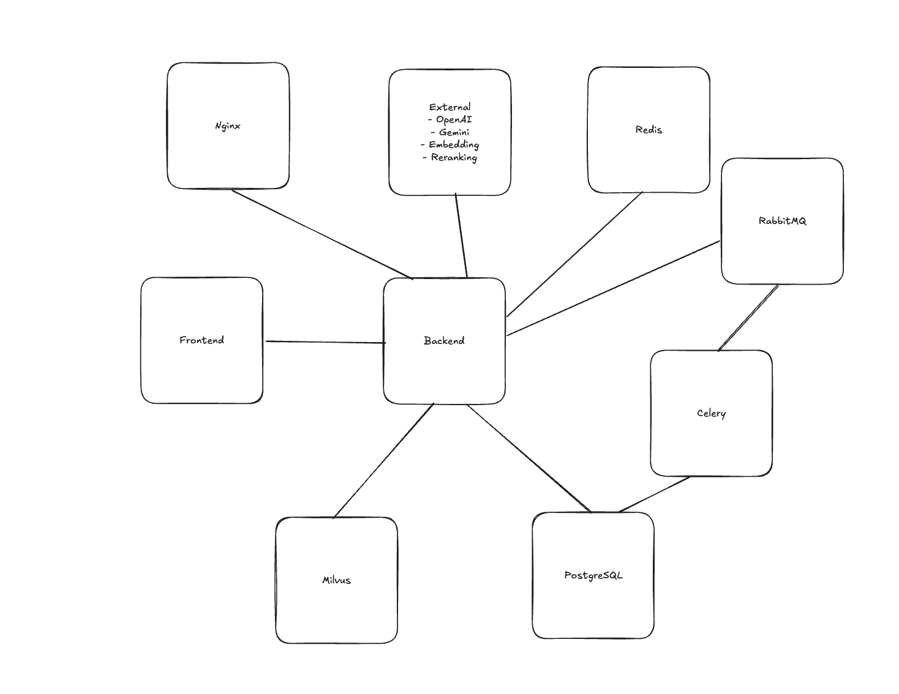
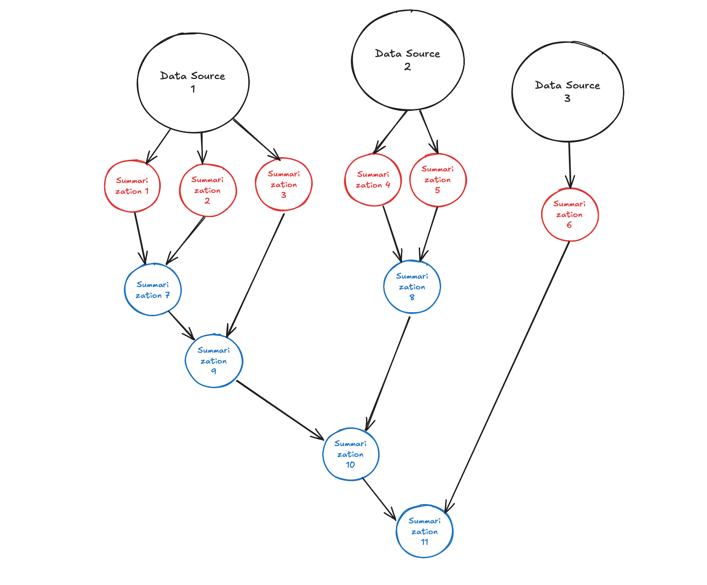
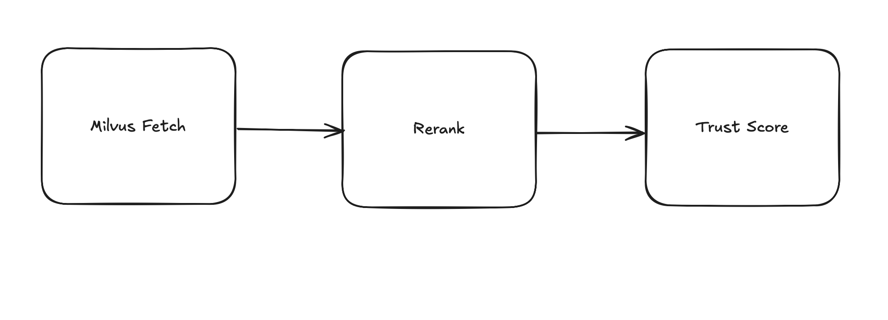
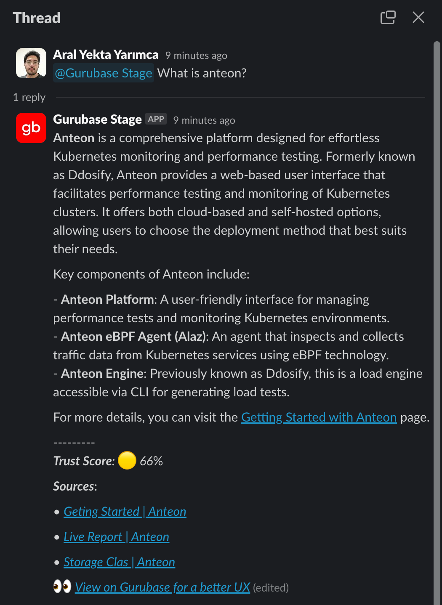
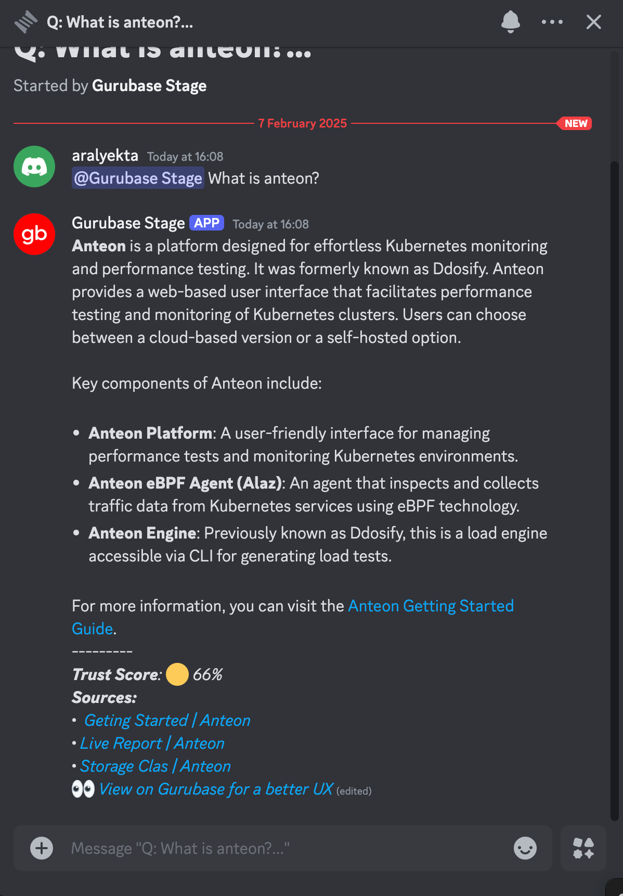
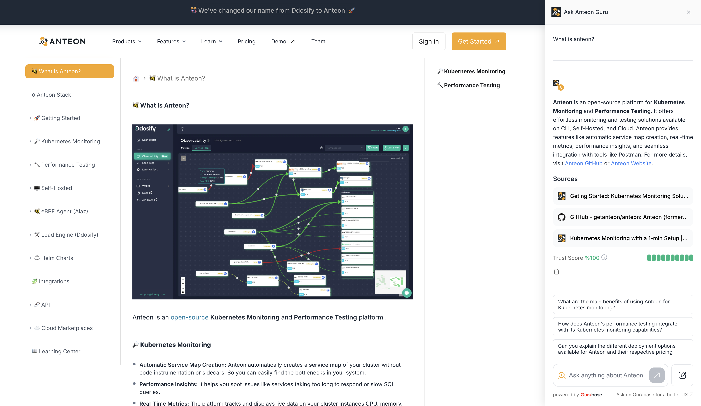

# Gurubase Architecture Documentation

## Overview

Gurubase is a scalable RAG (Retrieval Augmented Generation) system built to provide AI-powered knowledge bases. The system processes various data sources, generates summaries, creates questions from those summaries, and provides context-aware answers using advanced LLM techniques.

## System Components



### Frontend (Next.js)
- Built with Next.js
- Communicates with backend via REST APIs
- Provides interfaces for:
  - Question answering
  - Data source management
  - Binge sessions

### Backend (Django)
- Core logic implementation
- REST API endpoints
- Celery task management
- Database models and migrations
- Vector similarity search integration

### Milvus
- Vector database for similarity search
- Stores embeddings for:
  - Data source chunks
  - Questions
  - Summaries

### Redis
- Caching layer for:
  - Rate limiting
  - Task locking
  - Keeping track of task status
- Used by Celery as message broker

### RabbitMQ
- Message queue for Celery tasks
- Handles asynchronous task distribution

### Celery
- Asynchronous task processing
- Handles:
  - Data source processing
  - Summary generation
  - Question generation
  - Vector similarity updates
  - LLM evaluations

### PostgreSQL
- Primary database
- Stores:
  - User data
  - Questions and answers
  - Data sources
  - Guru types
  - System settings

### Nginx
- Static file serving
- Media file storage
- Load balancing

### External
- OpenAI
- Gemini
- Embedding API
- Reranking API

## Core Features

### Authentication

The system does not use authentication in the selfhosted mode.

### Embedding

The system has two options for embedding:
- OpenAI
- Custom Embedding API

This option can be configured using the `USE_OPENAI_TEXT_EMBEDDING` and `EMBED_API_URL` settings in `backend/backend/settings.py`. If the `USE_OPENAI_TEXT_EMBEDDING` is set to `True`, the `EMBED_API_URL` is ignored.
TODO: Add details on how to set custom embedding API.

> Important: It is recommended not to change these options after the system is set up as the corresponding embedding dimension is used in Milvus. Upon change, Milvus collections need to be recreated with the new dimension.

### Milvus Details

This is the schema used for Milvus collections:

```python
    schema = MilvusClient.create_schema(
        auto_id=True,
        enable_dynamic_field=False,
    )

    # 2. Add fields to schema
    schema.add_field(field_name="id", datatype=DataType.INT64, is_primary=True)
    schema.add_field(field_name="vector", datatype=DataType.FLOAT_VECTOR, dim=settings.MILVUS_CONTEXT_COLLECTION_DIMENSION)
    schema.add_field(field_name="text", datatype=DataType.VARCHAR, max_length=65535)
    schema.add_field(field_name='metadata', datatype=DataType.JSON)

    # 3. Prepare index parameters
    index_params = client.prepare_index_params()

    # 4. Add indexes
    index_params.add_index(
        field_name="id",
        index_type="STL_SORT"
    )

    index_params.add_index(
        field_name="vector", 
        index_type="AUTOINDEX",
        metric_type="COSINE",
    )

    # 3. Create a collection
    client.create_collection(
        collection_name=collection_name,
        schema=schema,
        index_params=index_params
    )
```

It uses cosine similarity for the vector field.

### Managing Guru Types

Creating and updating guru types also syncs their Milvus collection accordingly by the signals `create_milvus_collection`, `rename_milvus_collection` in `backend/core/signals.py`.

### Managing Data Sources

Four types of data sources are supported:
- YouTube videos
- Websites
- PDFs
- Codebases

#### YouTube videos

The system uses the `YoutubeLoader` from `langchain_community.document_loaders` to extract content from YouTube videos. This requires the videos to be public and have subtitles to extract content. It formats the transcript, and transfers it to Milvus.

#### Websites

The system uses `firecrawl` to extract content from websites. It scrapes the website, gets the relevant metadata, formats the content, and transfers it to Milvus.

> Setting `FIRECRAWL_API_KEY` is required for this process.

#### PDFs

The system uses `PyPDFLoader` from `langchain_community.document_loaders` to extract content from PDFs. It formats the content, and transfers it to Milvus. The PDF files are also saved to the local storage in self-hosted version.

#### Codebases

You can also provide a Github repository URL to index your codebase. The system will use the codebase as a data source while answering questions. You can only provide one Github repository URL per guru type.

#### Data Retrieval

The task `data_source_retrieval` in `backend/core/tasks.py` is responsible for processing data sources. It goes through all data sources that have the status `NOT_PROCESSED` and writes them to Milvus, marking them as `PROCESSED` and `in_milvus=True` when done. 
- This task locks each guru type to prevent multiple tasks from processing the same guru type at the same time. This allows multiple guru types to be processed in parallel. 
- It also allows Github repositories and other data sources to be processed in parallel.

##### Codebases

The task `process_github_repository` in `backend/core/github_handler.py` is responsible for Github repository retrieval. It does the following:
- Clones the repository
- Extracts default branch name
- Goes through the files, picks the valid ones
- Saves the valid files as `GithubFile` objects in the database

The file validity is determined through the steps:

1. Skip the common build/cache/env directories (like bin, obj, target, etc.)
2. Only process files if they are code files or package manifest files
  - The rules for these are determined in `code_file_extensions` and `package_manifest_file_extensions` dictionaries in `backend/core/github_handler.py`
3. Skip files larger than 10MB

> On cloud: After these steps, a total file count and size limit is applied. And the repository is rejected if it exceeds these limits.

> On self-hosted: The repository is processed without any limits.

Then the data is written to Milvus.


#### Writing to Milvus

The processed data sources are written to Milvus using the `write_to_milvus` method in `backend/core/models.py` under the `DataSource` model. This function splits the content into chunks, embeds them using the specified embedding model, and inserts them into Milvus. For further details on the embedding model, see the [Embedding](#embedding) section.

There are 3 settings for the text splitting:
- `SPLIT_SIZE`: The maximum number of characters in a chunk
- `SPLIT_MIN_LENGTH`: The minimum number of characters in a chunk
- `SPLIT_OVERLAP`: The number of characters to overlap between chunks

It is recommended to use the default settings, and fine-tune them if needed.

#### Deleting a Data Source

Deleting a data source from the database is handled by the `clear_data_source` signal in `backend/core/signals.py`. It deletes the data source from Milvus and the local storage in self-hosted version.

#### Reindexing a Data Source

Reindexing a data source allows users to update the data source in Milvus without deleting and re-uploading it. This is useful for cases where the data source has been updated.

##### Codebases

Reindexing codebases is done automatically by the task `update_github_repositories`. It clones the repository again, and syncs updates like file updates, creations, deletions, etc. to the database through the `GithubFile` model. It still applies a file count and size limit check.

#### Data Source Summarization

The system also creates summarizations for each guru type from its data sources using the `summarize_data_sources` task in `backend/core/tasks.py`. This task locks each guru type to prevent multiple tasks from processing the same guru type at the same time. However, it does not lock the data sources themselves to allow multiple guru types to be processed in parallel.

The summarizations are saved in the database as `Summarization` objects.

The task is run in three stages:
1. Initial summarization of data source chunks (using `create_initial_summarizations` in `backend/core/models.py` under the `DataSource` model). It splits the data source into chunks and summarizes each of them.

> Initial summarizations refer to the summarizations that are created from the data source chunks directly. After that point, the summarizations are created recursively.

> The data source is split into chunks, and each chunk is summarized.

2. Recursive summarization of other summarizations (using `finalize_data_source_summarizations` in `backend/core/utils.py`). This process merges the summarizations of each data source layer by layer to reach a final summarization for that data source.

> Recursive summarizations refer to the summarizations that are created from the initial summarizations. They are created by merging the summarizations and re-summarizing them until the summarization is smaller than the `SUMMARIZATION_MAX_LENGTH`.

3. Creating a guru type summarization (using `create_guru_type_summarization` in `backend/core/utils.py`). This process merges the final summarizations of all data sources to create a single summarization for the guru type.

An example of the summarization process looks like this:



In this example, the red summarizations are the initial summarizations, and the blue summarizations are the recursive summarizations. And summarization 11 is the final summarization of the whole guru type. While the first stage creates summarizations 1-6, the second stage creates summarizations 7 and 8, and the third stage creates summarizations 9-11.

> While splitting, if the last chunk is smaller than the `SUMMARIZATION_MIN_LENGTH`, it is merged with the previous chunk.

The settings for this process are:

- `SUMMARIZATION_MAX_LENGTH`: The maximum length of the data source chunks to be summarized
- `SUMMARIZATION_OVERLAP_LENGTH`: The number of characters to overlap between the data source chunks
- `SUMMARIZATION_MIN_LENGTH`: The minimum length of the data source chunks to be summarized
- `SUMMARY_GENERATION_MODEL`: The model to use for summarization. Two options are available:
    - `gpt-4o-2024-08-06`
    - `gemini-1.5-flash-002`

#### Re-Answer Upon Data Source Update/Deletion

Upon relevant data source update/deletion, the system re-answers the existing questions upon their next request. The logic for this is the following:

- If a new data source is added to the guru type
- If one of the data sources is updated in the guru type

Then all of the questions in the guru type are re-answered when they are asked.

- If a data source that was used to answer a question is deleted

Then that specific question is re-answered when it is asked.

### RAG Implementation

The RAG implementation consists of three main phases:
1. Summary Generation
2. Context Retrieval
3. Answer Generation

> All of these steps use the `GPT_MODEL` setting in `backend/backend/settings.py`.


#### 1. Summary Generation (`/summary/` endpoint)

The summary generation phase validates and processes the incoming question:

```python
@api_view(['POST'])
@combined_auth
def summary(request, guru_type):
    # 1. Validate guru type and check reranker health
    validate_guru_type(guru_type)
    if not reranker_requester.rerank_health_check():
        return Response({'msg': "Reranker is not healthy"})

    # 2. Check for existing questions (cache hit)
    existing_question = search_question(
        request.user, 
        guru_type_object, 
        binge, 
        None, 
        question
    )

    # 3. Generate summary if no cache hit
    answer = get_question_summary(question, guru_type, binge, widget=False)
```

The summary generation process:
1. Question Validation
   - Checks if question is appropriate for the guru type
   - Validates length and content
   - Generates a unique slug

2. Intent Analysis
   - Determines user intent
   - Sets appropriate answer length
   - Identifies question type

3. Cache Management
   - Checks for existing identical questions
   - Validates if cached answer needs refresh

The prompt used for this process is `summary_template` in `backend/core/prompts.py`:

```python
"""
You are a {guru_type} Guru. You have sufficient knowledge about {domain_knowledge}.
Return a summary of the question given.
<question> is the prettier version the question provided by the user. Fix grammar errors, make it more readable if needed. Maximum length is 60 characters but don't sacrifice clarity or meaning for brevity.
If the question is not related with {guru_type}, set "valid_question": false. If the question contains {guru_type} and is related, set "valid_question": true.
<question_slug> should be a unique slug for the question and should be SEO-friendly, up to 50 characters, lowercase and separated by hyphens without any special characters.
<description> should be 100 to 150 characters long meta description.
<user_intent> should be a short summary of the user's intent. It will be used to determine the question answer length. It can be short answer, explanation, how to, why, etc. Short answer is simple and up to 100 words, the others are SEO friendly and between 600-1200 words.
<answer_length> should be a number that indicates the answer word count depending on the user's intent. {summary_prompt_widget_addition}

For any questions related to date, remember today's date is {date}.
"""
```

> If a question with the same slug or text exists, it is returned immediately. The Frontend then uses the returned `question_slug` to fetch the existing answer. However, this does not happen in binge sessions.

#### 2. Context Retrieval



The `vector_db_fetch` function in `backend/core/utils.py` is responsible for context retrieval. It happens in multiple stages:

- Fetching stackoverflow sources from Milvus (not present in self-hosted version)
  - Fetches the most related 3 stackoverflow questions that have an accepted answer. For these, fetch the following:
    - The question
    - The accepted answer
    - The other answers that have greater score than the accepted answer

- Fetching user data sources from Milvus
  - Fetches the most related chunks from 3 different user data sources. Also finds the closest 5 chunk for each data source for merging.

- Reranking the sources
  - Reranks the sources by the similarity score
  - TODO: Explain how reranking works and configured

- Filtering the sources by trust score
  - Trust score is evaluated by an LLM as a metric of context relevance. If a context has a trust score less than the specified threshold, it is not used.
  - If no context passes the trust score, the system rejects the question as contexts are not relevant enough.
  - The prompt used for this process is `context_relevance_prompt` in `backend/core/prompts.py`:

```python
"""
You are a {guru_type} Guru. You have sufficient knowledge about {domain_knowledge}. 
You evaluate if the provided contexts are relevant to the question.

You will be given a QUESTION, a USER QUESTION, and a set of CONTEXTS fetched from different sources like Stack Overflow, text-based documents (PDFs, txt, word, files, etc.), websites, YouTube videos, etc. The QUESTION is the prettified version of the USER QUESTION.

Here is the grade criteria to follow:
(1) Your goal is to identify how related the CONTEXTS are to the QUESTION and how helpful they are to answer the question.
(2) CONTEXTS could be providing the exact answer, relevant information, or be completely unrelated to the QUESTION.
(3) CONTEXTS containing the exact answer to the question should be given a score of 1.
(4) CONTEXTS containing relevant information to the question should be given a score between 0 and 1. The more relevant the information, the higher the score.
(5) CONTEXTS containing no relevant information to the question should be given a score of 0.

Here is an example:

QUESTION: What is the difference between a static method and an instance method in Python?

CONTEXTS
<context id="1">
Context 1 Metadata:
{{"type": "WEBSITE", "link": "https://link_to_context", "title": "Title of the context"}}

Context 1 Text: 
Static methods are methods that are bound to a class rather than its instances.
</context>

--------

<context id="2">
Context 2 Metadata:
{{"type": "WEBSITE", "link": "https://link_to_context", "title": "Title of the context"}}

Context 2 Text: 
Instance methods are methods that are bound to an instance of a class.
</context>

--------

<context id="3">
Context 3 Metadata:
{{"type": "WEBSITE", "link": "https://link_to_context", "title": "Title of the context"}}

Context 3 Text: 
Instance methods can execute like normal functions.
</context>

--------

<context id="4">
Context 4 Metadata:
{{"type": "WEBSITE", "link": "https://link_to_context", "title": "Title of the context"}}

Context 4 Text: 
This is a comment unrelated to the question.
</context>

EXPECTED OUTPUT:

{expected_output}

Explain your reasoning for each context in a step-by-step manner to ensure your reasoning and conclusion are correct.

Your output should be a json in the following format. Contexts list size should be the same as the number of contexts provided. Each score in a context should ALWAYS be between 0 and 1. The number of contexts given should be the same as the number of contexts of your output.

{output_format}
"""
```


Settings for this process:
- In the `Settings` model object with `id=1`, the following fields are user configurable:
  - `rerank_threshold`: The threshold for the reranking score. It is between 0 and 1.
  - `trust_score_threshold`: The threshold for the trust score. It is between 0 and 1.

#### 3. Answer Generation (`/answer/` endpoint)

The answer generation phase handles the final response:

```python
@api_view(['POST'])
@stream_combined_auth
def answer(request, guru_type):
    response, prompt, links = stream_question_answer(
        question, 
        guru_type, 
        user_intent, 
        answer_length, 
        user_question, 
        parent_question
    )
```

The prompt used for this process is `prompt_template` in `backend/core/prompts.py`:

```python
"""
You are a {guru_type} Guru with extensive knowledge about {domain_knowledge}. Your task is to answer questions thoughtfully and accurately, using the contexts provided and adhering to strict guidelines.

{github_details_if_applicable}

{binge_mini_prompt}

First, carefully read and analyze the following contexts:

<contexts>
{contexts}
</contexts>

When answering the question, follow these guidelines:
1. Use only the information provided in the contexts. Do not use prior knowledge or hallucinate information.
2. Contexts are not the exact answer, but they are relevant information to answer the question.
3. Highlight critical information in bold for emphasis.
4. Explain concepts whenever possible, being informative and helpful.
5. Provide references and links to sources mentioned in the context links and titles when applicable. Do not reference like "Context 1" or "Context 2". Add references like [Title](link) if applicable.
6. Demonstrate concepts with examples when possible.
7. Use code blocks for any code snippets.
8. Use exact names from contexts for functions/classes/methods.
9. Answer the question based on the user's intent: {user_intent}.

Based on this intent, provide a {answer_length} words answer to the user question and question that is the prettier version of the user question with the grammar fixed and more readable.

Format your answer in markdown (.md) format, following these rules:
1. Start with an h1 (#) header that matches the question exactly.
2. Do not add a new line at the beginning.
3. Do not use introductory phrases like "Sure!", "Yes", or "No" at the start.
4. Do not wrap the answer with ```md```.
5. Do not provide anchors for localhost domains.

Handling Edge Cases:
1. If contexts lack enough information:
  - State this limitation.
  - Provide the best partial answer.
  - Suggest sources or methods to find missing info.
2. If the query is unrelated to {guru_type}:
  - Inform the user and explain why.
  - Suggest how to rephrase the question to relate to {guru_type}.

Use the markdown guide provided earlier for proper formatting.

Remember, today's date is {date}. Use this information if any date-related questions arise.

I will give you the user question and question.
"""
```

### Binge Sessions

Upon asking a follow up question, the system creates a binge session. This session is a structured way to explore related questions. The `prepare_chat_messages` function in `backend/core/utils.py` is responsible for preparing the prompts and messages in a binge session. This is how it works:

1. All of the previous questions are fetched from the database
2. Their question texts and the answer to the last question is given to the LLM to generate the answer 

```python
    from core.prompts import prompt_template, binge_mini_prompt
    """Prepare messages for the chat completion API."""
    user_message = f"User Question: {user_question}\nQuestion: {question}"
    
    if history:
        question_history = format_question_history(history)
        last_answer = history[-1]['answer']
        binge_mini_prompt = binge_mini_prompt.format(
            question_history=question_history,
            answer=last_answer
        )
    else:
        binge_mini_prompt = ""
    
    # Insert binge_mini_prompt into the main prompt
    final_prompt = prompt_template.format(
        binge_mini_prompt=binge_mini_prompt if history else "",
        **guru_variables,
        **context_vals
    )
    
    messages = [
        {'role': 'system', 'content': final_prompt},
        {'role': 'user', 'content': user_message}
    ]
    
    return messages
```

This is the binge prompt that is inserted into the main prompt:

```
The user has started a conversation with you. The previously asked questions are:
{question_history}
And the answer to the last question is:
<last_answer>
{answer}
</last_answer>
Now, the user asked another question.
```

### Integrations
Integrations allow users to use Gurubase in their own platforms. They are basically wrappers around the `/summary` and `/answer` endpoints. They can be managed in the `Integrations` page in the Guru dashboard.

The following integrations are available:
- Slack
- Discord
- Web Widget

#### Slack



##### Cloud


Slack integration on the cloud is straightforward. You just have to go through the installation process from the dashboard. Once the installation is complete, you need to select channels to listen to. Then, you can start using the bot by mentioning it in the selected channels and asking questions.


> You can click on the "Send Test Message" button to test if the integration is working.

##### Self-Hosted

TODO:

> For private channels, you need to invite the bot to the channel manually.

#### Discord



##### Cloud

Discord integration is similar to Slack. You need to go through the installation process from the dashboard. Once the installation is complete, you need to select channels to listen to. Then, you can start using the bot by mentioning it in the selected channels and asking questions.


> You can also click on the "Send Test Message" button to test if the integration is working.


##### Self-Hosted

TODO:

> For private channels, you need to invite the bot to the channel manually.

#### Web Widget



Web widget allows you to embed Gurubase to your own website. You need to create a widget id from the dashboard by providing the domain of your website. Then, the embedding html is available in the page. You can embed it to your website by just pasting the html to the page. For other installation methods or further details, you can check the [Github README](https://github.com/Gurubase/gurubase-widget).


